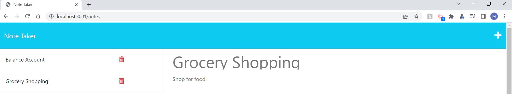

# Note-Taker-Refractor

## URL
https://note-taker-refractor.herokuapp.com/

## Description

This project is a note taker application that allows the user to take notes.
The user is presented with a landing page stating to start taking notes.
The user will be shown a list of existing notes (if created and saved) and an area to add a note title and description.
While the user inputs information for the note, the save icon will appear.
The user is allowed to add a new note or delete a old note.
When the note is selected, the note title and description will appear.

## Summary

```
GIVEN a note-taking application
WHEN I open the Note Taker
THEN I am presented with a landing page with a link to a notes page
WHEN I click on the link to the notes page
THEN I am presented with a page with existing notes listed in the left-hand column, plus empty fields to enter a new note title and the note’s text in the right-hand column
WHEN I enter a new note title and the note’s text
THEN a Save icon appears in the navigation at the top of the page
WHEN I click on the Save icon
THEN the new note I have entered is saved and appears in the left-hand column with the other existing notes
WHEN I click on an existing note in the list in the left-hand column
THEN that note appears in the right-hand column
WHEN I click on the Write icon in the navigation at the top of the page
THEN I am presented with empty fields to enter a new note title and the note’s text in the right-hand column
```

## Installation

npm init -y
npm i inquirer@8.2.4
npm start

## Usage

This is a note taking website where the user can take notes and create a list of notes.





## Credits

N/A

## License

Please refer to the LICENSE in the repo.
